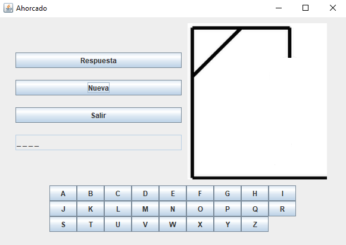
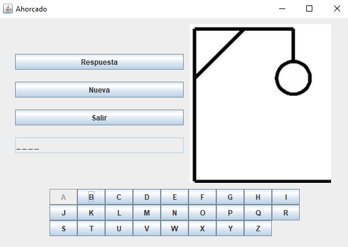
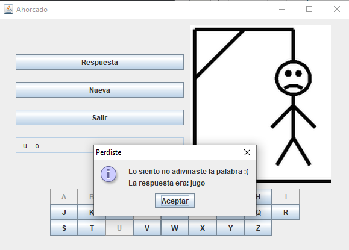
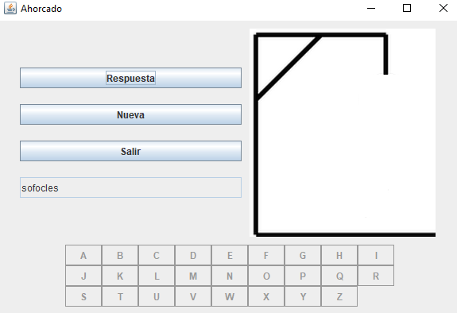

# Ahorcado
Para aprender a utilizar las Interfaces de Java. Este proyecto crea un juego de "Ahorcado", tomando las palabras de un archivo con el nombre 'Palabras.txt'.

El archivo de las palabras tiene una estructura simple que se debe seguir: Cada línea debe contener una sola palabra, de preferencia sin caracteres especiales y sin espacios.

El programa lee ese archivo desde la carpeta principal del proyecto, al igual que las imágenes que se usan para representar el juego y las oportunidades restantes.

El juego sigue las reglas usuales, se elige una letra y si no es parte de la palabra se aumenta el dibujo, hasta terminar la palabra o completar el dibujo. Se puede elegir reiniciar, elegir una palabra diferente o cerrar el juego.

El código fuente se encuentra dentro de la carpeta 'src', el programa fue creado en Java y utilizando NetBeans IDE, de ahí que el proyecto posea un número variado de carpetas.

Al iniciar se muestra la interfaz de la siguiente imagen, para empezar el juego se debe presionar la opción "Nueva" y se muestran los espacios vacíos de la palabra que deberá ser adivinada:

Las letras se irán bloqueando según se usan y el dibujo se irá completando hasta su forma final:

Si la palabra fue adivinada el mensaje dirá que ha ganadono, en caso contrario, se muestra la solución en un mensaje de alerta:

La opción "Respuesta" bloqueará el teclado y mostrará la respuesta, dejando unicamente opción de salir o jugar con una palabra nueva:

